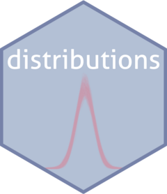

<!-- README.md is generated from README.Rmd. Please edit that file -->

```{r, include = FALSE}
knitr::opts_chunk$set(
  collapse = TRUE,
  comment = "#>",
  fig.path = "man/figures/README-",
  out.width = "100%"
)
```

# distributions <a href="https://agarbuno.github.io/distributions/"></a>


<!-- badges: start -->
[](https://github.com/agarbuno/distributions/actions/workflows/test-coverage.yaml)
[](https://github.com/agarbuno/distributions/actions/workflows/pkgdown.yaml)
[](https://github.com/agarbuno/distributions/actions/workflows/document.yaml)
<!-- badges: end -->

The goal of distributions is to ...

## Installation

You can install the development version of distributions from [GitHub](https://github.com/) with:

``` r
# install.packages("devtools")
devtools::install_github("agarbuno/distributions")
```

## Example

This is a basic example which shows you how to solve a common problem:

```{r example}
library(distributions)
## basic example code
```

What is special about using `README.Rmd` instead of just `README.md`? You can include R chunks like so:

```{r cars}
summary(cars)
```

You'll still need to render `README.Rmd` regularly, to keep `README.md` up-to-date. `devtools::build_readme()` is handy for this. You could also use GitHub Actions to re-render `README.Rmd` every time you push. An example workflow can be found here: <https://github.com/r-lib/actions/tree/v1/examples>.
