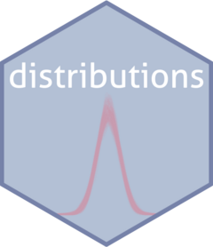

<!-- README.md is generated from README.Rmd. Please edit that file -->

# distributions <a href="https://agarbuno.github.io/distributions/"></a>

<!-- badges: start -->

[](https://github.com/agarbuno/distributions/actions/workflows/test-coverage.yaml)
[](https://github.com/agarbuno/distributions/actions/workflows/pkgdown.yaml)
<!-- badges: end -->

The goal of `distributions` is to have a standard collection of objects
to define random variables in `R`. The philosophy of this package
follows the same principles found in
[Numpy](https://numpy.org/doc/stable/reference/random/index.html) or
[Julia](https://juliastats.org/Distributions.jl/stable/). That is, the
emphasis is having an object representing an a random variable for which
we can query according to our interests. For example, to evaluate the
density function or generate random numbers.

This is mainly done to avoid the typical `R` syntax of the family of
functions that surround a random variable. See for example the functions
needed for a [normal random
variable](https://rdrr.io/r/stats/Normal.html).

The main objective of this package is to be used in my teaching but I am
happy to extend it further to a more general use if needed.

## Installation

You can install the development version of `distributions` from
[GitHub](https://github.com/) with:

``` r
# install.packages("devtools")
devtools::install_github("agarbuno/distributions")
```

## Example

This is a basic example which shows how to define a standard normal
random variable.

``` r
library(distributions)
x <- GaussianRandomVariable$new()
x
#> <Gaussian>
#>   Inherits from: <ContinuousRandomVariable>
#>   Public:
#>     density: function (x, log = TRUE) 
#>     initialize: function (mean = 0, sd = 1) 
#>     mean: 0
#>     sample: function (nsamples = 1) 
#>     sd: 1
```

``` r
class(x)
#> [1] "Gaussian"                 "ContinuousRandomVariable"
#> [3] "R6"
```

You can use the `sample` or the `density` methods to either generate
random numbers from this random variable or evaluate its density
function. For example, we can generate a collection of 100 random points
or evaluate the density function in 1.

``` r
x$sample(100)
x$density(1)
```

You’ll still need to render `README.Rmd` regularly, to keep `README.md`
up-to-date. `devtools::build_readme()` is handy for this. You could also
use GitHub Actions to re-render `README.Rmd` every time you push. An
example workflow can be found here:
<https://github.com/r-lib/actions/tree/v1/examples>.
